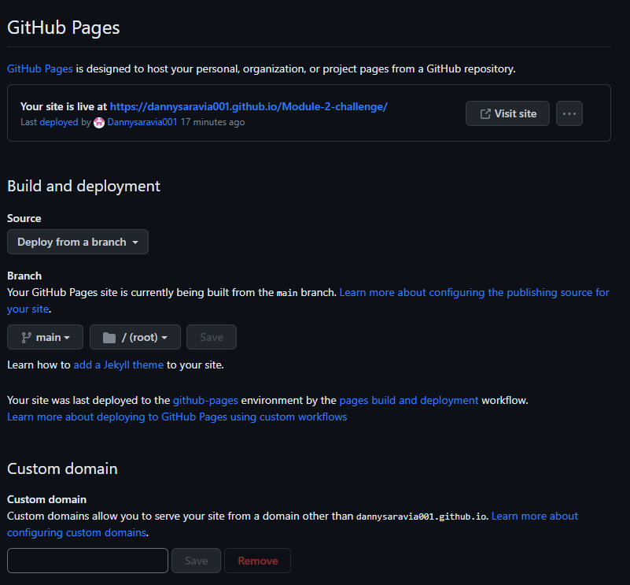

# Module-2-challenge

## Description
The purpose of this project is to make a professional portfolio to show to others. It's shown to see what the developer can do, what they've done, and the past projects they've worked on. This project was made from scratch.

## Installation

N/A

## Usage
To navigate through the webpage, click on the header links. the work section has links in the boxes to show what projects were made.

## Credits

N/A

## License

Refer to the repo for licenses. 

## screenshots of the webpage

## Webpage link

https://dannysaravia001.github.io/Module-2-challenge/